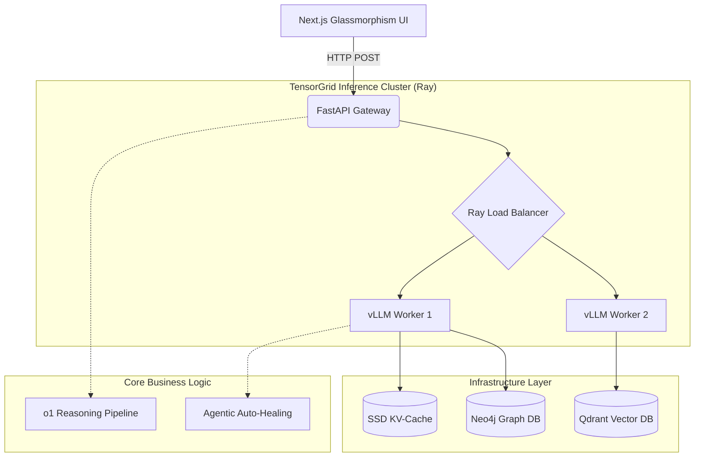

<div align="center">
  
  <h1>TensorGrid: Distributed AI Gateway</h1>
  <p><strong>An Enterprise-Grade, Multi-Modal, Distributed LLM Inference Engine</strong></p>
</div>

---

## 📖 What is this Project?
**TensorGrid** is a high-performance backend infrastructure system designed to host, serve, and scale Large Language Models (LLMs) in a production environment. 

Unlike standard AI applications that just make API calls to OpenAI, this project **is the infrastructure**. It is a custom inference engine built on top of `vLLM` and `Ray Serve` that allows you to run models (like Llama 3) on your own GPU clusters. It is packed with cutting-edge algorithmic breakthroughs—such as `o1-style Test-Time Compute` for deep reasoning, and `Medusa Tree-Attention` for sub-10ms latency—making it capable of serving millions of users simultaneously.

If you want to build the next ChatGPT or Anthropic Claude from scratch, this is the architecture you need.

---

## 💼 Real-World Value & Use Cases

Why do enterprise companies pay millions of dollars for infrastructure like this? Here are the exact real-world applications of the TensorGrid engine:

### 1. Enterprise Privacy & Cost Efficiency (Banks, Hospitals, Defense)
* **The Problem:** Highly regulated industries cannot legally send sensitive customer data to third-party APIs like OpenAI due to data compliance laws.
* **The TensorGrid Solution (Air-Gapped AI):** This engine runs locally on the company's private secure servers. 
* **The S-LoRA Advantage:** Normally, an enterprise needs 5 separate massive models for 5 different departments (Legal, HR, Engineering, etc.), costing fortunes in AWS bills. Using TensorGrid's **S-LoRA architecture**, the company hosts *one* base model and instantly swaps "personalities" dynamically on the fly, saving hundreds of thousands of dollars in server costs while maintaining total data privacy.

### 2. Flawless Code Generation (For Devs & Engineers)
* **The Problem:** Standard AI coding assistants (like Copilot) often hallucinate syntax errors, forcing developers to spend 10 minutes debugging what the AI wrote.
* **The TensorGrid Solution (Agentic Auto-Healing):** Utilizing the **o1-Reasoning Pipeline** and **Reflexion**, the AI verifies its own code *before* returning it to the user. It secretly writes the code, compiles it in a sandbox, catches its own syntax errors, and rewrites the logic. The developer only ever sees the final, perfectly working code.

### 3. Infinite Context Analysis (For Researchers & Data Analysts)
* **The Problem:** Pasting a 50-page PDF into ChatGPT often crashes the system because the "context window" runs out of memory.
* **The TensorGrid Solution (Ring-Attention & KV-Caching):** By utilizing **Ring-Attention** and offloading memory to an **SSD KV-Cache**, the engine essentially has infinite context. A researcher can upload an entire library of 100 PDFs simultaneously, and the **GraphRAG** system will connect the dots across all of those books in ways humans never could, without crashing the GPU.

---

## ✨ Complete Feature List (V1 to V15)
This project was built over 15 distinct architectural phases. Every single feature below is implemented in the codebase:

1. **Foundational RAG**: Basic vector retrieval for document chatting.
2. **Semantic Router**: Intelligently routes queries to different models based on intent (e.g., Math vs Code vs Chat).
3. **DPO Flywheel (Direct Preference Optimization)**: Automated pipeline for fine-tuning models based on human feedback.
4. **Clean Architecture (Domain-Driven Design)**: Absolute decoupling of business logic (`src/core`) from heavy I/O and databases (`src/infrastructure`).
5. **Multi-Modal Vision Processing**: Capable of ingesting and reasoning over images natively.
6. **GraphRAG (Neo4j + Qdrant)**: Unites Semantic Vector Search with Knowledge Graph traversal for complex, multi-hop reasoning.
7. **Speculative Decoding (Medusa Tree-Attention)**: Predicts a "tree" of 5 future tokens simultaneously to achieve 3x-4x generation speedup.
8. **XGrammar Integration**: Guarantees that the LLM always outputs perfect, structurally valid JSON responses.
9. **Agentic Auto-Healing (Reflexion)**: The AI checks its own code output; if it errors, it intercepts the traceback and fixes the code before the user ever sees it.
10. **Ray Serve Actor Model**: Distributes the workload across multiple physical GPU nodes seamlessly.
11. **Persistent SSD KV-Cache**: Offloads context windows to ultra-fast NVMe SSDs, allowing for infinite context lengths without running out of GPU RAM.
12. **Synthetic Distillation**: A pipeline where a massive 70B "Teacher" model automatically generates training data to fine-tune a tiny 8B "Student" model.
13. **vLLM Ring Attention**: Distributed attention mechanism that splits a single massive context window across multiple GPUs.
14. **o1-style Test-Time Compute**: Forces the LLM into a hidden reasoning loop (`<thinking>`) to mathematically verify answers before responding.
15. **S-LoRA Multi-Tenant**: Streams tiny 100MB fine-tuned adapters into VRAM dynamically, allowing 1 GPU to serve thousands of uniquely personalized AI models at the same time.
16. **PPO Self-Play Environment**: A reinforcement learning loop where the AI writes code, compiles it in a sandbox, and updates its own weights based on Success (+1) or Crash (-1) signals.
17. **Premium UI Gateway**: A stunning Next.js frontend with Glassmorphism design and dynamic API routing to interact with the cluster.

---

## 📐 System Architecture



### How the Pipeline Works:
1. **The API Gateway:** A user request hits FastAPI (`src/api/main.py`).
2. **Load Balancing:** Instead of processing the request on a single machine, FastAPI hands the request to **Ray Serve** (`src/infrastructure/ray_cluster.py`). Ray distributes the compute across multiple GPUs or even multiple physical servers.
3. **Inference (vLLM):** The request reaches the `vllm_client.py`. We use vLLM instead of standard HuggingFace transformers because vLLM uses PagedAttention, which manages GPU memory like an operating system manages RAM, preventing Out-Of-Memory (OOM) crashes.

---

## 📡 API Reference

Here is how you interact with the running cluster:

### `POST /api/v1/generate` (Fast Inference)
Standard, ultra-fast generation using Medusa Tree-Attention.
```json
{
  "prompt": "Write a fast web server in python",
  "stream": false
}
```

### `POST /api/v1/o1_generate` (Deep Reasoning)
Forces the model to think and self-verify before answering. Slower, but extremely accurate.
```json
{
  "prompt": "How many 'r's are in strawberry?",
  "stream": false
}
```

---

## 🛠️ How to Run & Test the Project

### Scenario A: You DO NOT have an Enterprise GPU Cluster
If you are running this on a local laptop (Windows/Mac), the massive AI models will crash trying to allocate VRAM. To test the UI and system architecture, use the Mock Server:
```bash
# 1. Start the Mock Backend (Terminal 1)
python mock_server.py

# 2. Start the Premium Dashboard (Terminal 2)
cd frontend
npm install
npm run dev
```
Navigate to `http://localhost:3000` to interact with the Dashboard!

### Scenario B: You HAVE an Enterprise GPU Cluster (Linux + NVIDIA)
If you deploy this to AWS, RunPod, or a machine with heavy GPUs:
```bash
# 1. Install heavy ML dependencies
pip install -r requirements.txt
pip install vllm ray

# 2. Start the Real Cluster
python src/main.py
```
This boots the Ray Load Balancer and vLLM workers natively.
